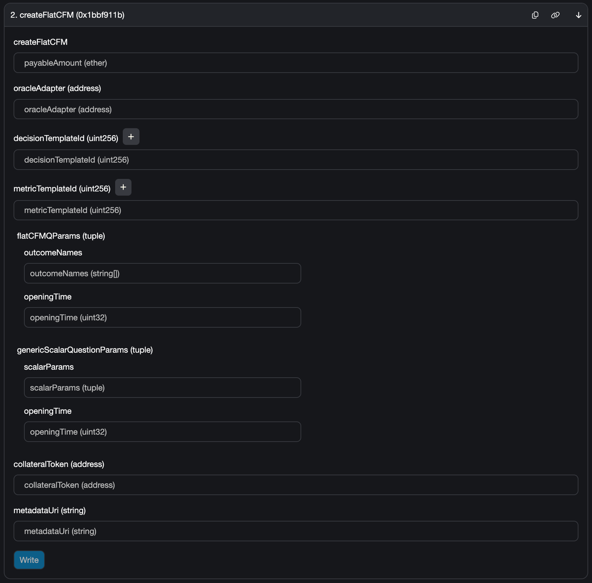
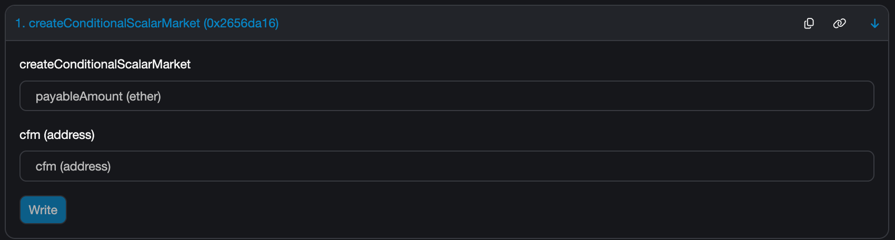

# how to

## install

```sh
forge soldeer install
```

## test

```sh
# unit tests:
forge test
# integration tests:
FOUNDRY_PROFILE=itest forge test
# fork tests:
FOUNDRY_PROFILE=ftest forge test
```

## deploy an oracle adapter

```sh
export QUESTION_TIMEOUT=3600
export MIN_BOND=100000000000000
forge script script/DeployFlatCFMRealityAdapter.s.sol \
    --rpc-url $RPC_URL \
    --broadcast \
    --sender $ADDRESS \
    --private-key $PRIVATE_KEY
```

## deploy a factory

```sh
export ORACLE_ADAPTER=0x1234...
export CONDITIONAL_TOKENS=0xabcd...
export WRAPPED1155_FACTORY=0x9999...
forge script script/DeployFlatCFMFactory.s.sol:DeployFlatCFMFactory \
    --rpc-url $RPC_URL \
    --broadcast \
    --sender $ADDRESS \
    --private-key $PRIVATE_KEY
```

## deploy a Reality template

Exemple decision template:

```sh
export TEMPLATE_CONTENT='{"title": "Which project got funded during CFM round #23?", "type": "multiple-select", "outcomes": [%s], "category": "cfm-decision", "lang": "en"}'
forge script script/CreateRealityTemplate.s.sol \
    --rpc-url "https://unichain-sepolia.infura.io/v3/$INFURA_PROJECT_ID" \
    --broadcast \
    --sender $ADDRESS \
    --private-key $PRIVATE_KEY
```


Example metric template:

```sh
export TEMPLATE_CONTENT='{"title": "Between the first block of 2025-01-01 and the last block of 2025-06-30, what is the average TVL in million USD, calculated at each block, for %s on BrandNewChain?", "type": "uint", "category": "cfm-metric", "lang": "en"}'
forge script script/CreateRealityTemplate.s.sol \
    --rpc-url "https://unichain-sepolia.infura.io/v3/$INFURA_PROJECT_ID" \
    --broadcast \
    --sender $ADDRESS \
    --private-key $PRIVATE_KEY
```

## deploy a new Flat CFM

### using a block explorer

First deploy the Flat CFM instance:



Then deploy each Conditional Scalar Market, one per outcome:




### using a config file

First, define a config file (by default, use `./flatcfm.config.json`), like

```json
{
  "factoryAddress": "0x1234567890abcdef1234567890abcdef12345678",
  "oracleAdapterAddress": "0x1234567890abcdef1234567890abcdef12345678",
  "decisionTemplateId": 24,
  "metricTemplateId": 42,
  "collateralToken": "0x1234567890abcdef1234567890abcdef12345678",
  "outcomeNames": [
    "Project A",
    "Project B",
    "Project C",
    "Project D"
  ],
  "openingTimeDecision": 1737111600,
  "minValue": 0,
  "maxValue": 100,
  "openingTimeMetric": 1737457200,
  "metadataUri": "ipfs://1234"
```

then run

```sh
forge script script/CreateFlatCFMFromConfig.s.sol \
    --rpc-url $RPC_URL \
    --broadcast \
    --sender $ADDRESS \
    --private-key $PRIVATE_KEY
```

# documentation

## mechansim: flat-cfm

The mechanism implemented here is a simplified version of
[CFMs](https://community.ggresear.ch/t/conditional-funding-markets/27) called
["Flat CFM"](https://butterd.notion.site/cfm-v1-mech-v0-2-Flat-CFM-13657e477193802f8abce08cd13aa979?pvs=74).

## architecture

`FlatCFM` represents the condition of funding. It is a market but it won't
be traded. It creates a `ConditionalScalarMarket` for each outcome it has (apart
from the special "Invalid" outcome, see below). It prepares an oracle question
and condition (as in `ConditionalTokens`) during construction. 

`ConditionalScalarMarket` represents the scalar market which is on the condition
of parent `FlatCFM`. This will be traded. It prepares an oracle question
and condition (as in `ConditionalTokens`) during construction. 

`FlatCFMRealityAdapter` implements an adapter pattern to access RealityETH from our
contracts, with a normalized interface (we want to later enable oracle
agnosticity).

`Types` defines basic data types for CFM decision questions, scalar
questions and nested conditional tokens.

The system follows these general steps:

1. `FlatCFMFactory` creates a new `FlatCFM` with specified
   parameters. And this automatically creates `ConditionalScalarMarket`s for
   each outcome.
1. The `FlatCFM` prepares their condition through `ConditionalTokens` and
   submits and oracle question via `FlatCFMRealityAdapter`.
1. Each `ConditionalScalarMarket` prepares their condition through
   `ConditionalTokens` and submits an oracle question via `FlatCFMRealityAdapter`.
   Within a given `FlatCFM`, each of these will have similar questions
   implemented by a common Reality template with a varying project name.
1. Users split their collateral into decision outcome tokens, then split again
   into scalar outcome tokens. These tokens are ERC20s and can be traded on
   AMMs.
1. When the oracle provides an answer to the decision question, the
   `FlatCFM` can be resolved and calculates payouts.
1. When the oracle provides an answer to the conditional scalar questions (all
   together), all `ConditionalScalarMarket`s can be resolved and calculate
   payouts.
1. Users can redeem their positions for payouts.

## dependency: ConditionalTokens

Gnosis' [Conditional Token framework](https://docs.gnosis.io/conditionaltokens/)
provides the ability to create and manipulate tokens that are tied to a specific
condition happening. `ConditionalTokens` is the core contract that manages among
others the creation and redemption of conditional tokens.

The codebase also rely on `Wrapped1155Factory` which enables wrapping 1155
outcome tokens in ERC20s so participants can trade them on any AMM.

Both these contracts are re-deployed in their original and audited versions. We
updated the build pipeling with modern tooling: see
[here](https://github.com/butterygg/conditional-tokens-contracts) and
[here](https://github.com/butterygg/1155-to-20).

## dependency: RealityETH

[Reality.eth](https://reality.eth.limo) is the first oracle for which an adapter
has been implemented. This is a general-purpose oracle which uses Kleros as an
arbitrator.

As with any external oracle, the CFM contracts economic security is limited by
the economic security of the Reality + Kleros system.

### edge case: RealityETH's invalid case

Reality can return
['invalid'](https://realityeth.github.io/docs/html/contracts.html?highlight=invalid)
in case the question can't be answered.

At the decision outcome level, an invalid case means CFM contracts can't figure
whether any project has succeeded in getting funded. Hence, it is equivalent to
the fact that none of the outcomes was returned by the oracle, ie that no
project got funded.  
In such a case, collateral redemption will be made available to participants in
a direct way, not accounting for any of the trading that happened in
`ConditionalScalarMarket`s.  
This is achieved by adding a supplementary decision outcome in `FlatCFM`s, which
will get the whole payout in such cases (no project got funded or Invalid).

At the individual project level with a scalar outcome, invalid means that CFM's
scalar markets can't know how to reward traders. It thus means that the market
should return collateral deposits as-is, hence allow merging of tokens but not
redemption.  
This is achieved by the same principle as above: `ConditionalScalarMarket`s
create 3 outcomes: Short, Long, Invalid. No facility is provided for trading
Invalid tokens.

### bounty payments

Reality bounties (and thus, `msg.value` forwarded by these contracts) are only
useful to guarantee that the arbitrator fee requirement is fulfilled. FlatCFM &
ConditionalScalarMarket deployers (Deployers) need to be aware of the amounts
required by the arbitrator that they're using, and will need to input a
`msg.value` at least matching the arbitrator fee.

On a crypto-economics level, the cfm-v1 protocol doesn't require "pure" Reality
bounties (aimed at incentivizing answers, what comes atop the arbitrator fee).
Indeed, Deployers are expected to make decisions with significant budget at
stake based on FlatCFMs markets resolving properly. This is providing a large
enough existing incentive for Reality questions to be answered to.
